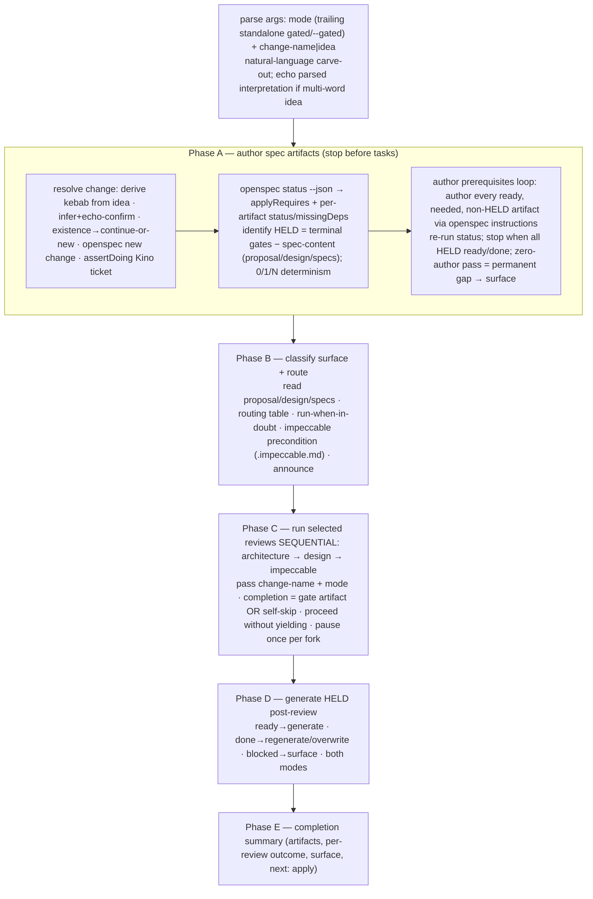
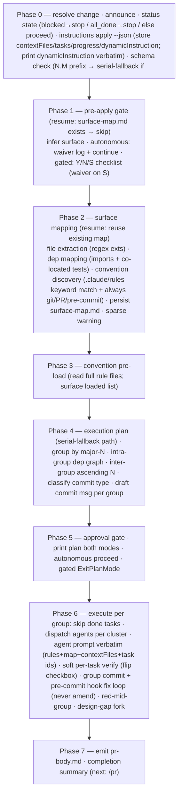

# harness:build — Source Map & Assembly Plan

`harness:build` assembles two kino skills — **`specd-new`** (authoring orchestration) and
**`specd-apply`** (implementation) — plus new behaviors decided in the design. This file captures
**everything the two source skills do**, so the assembly loses nothing. Verified by 3 adversarial
runs before assembling.

Legend for inventories: each line is a discrete behavior/datum. `[N]` = from specd-new, `[A]` = from
specd-apply, `[+]` = new build behavior. The assembly (§F) must account for every `[N]`/`[A]` line.

---

## A. specd-new — flow

## B. specd-new — behavior inventory (exhaustive)

**Modes & forks**
- [N] Two modes: autonomous (default) runs end-to-end, stops only at genuine forks; gated forwards `gated` to every review (per-finding triage + confirm-write).
- [N] Gated adds **no** orchestrator-level confirms — authoring + generating HELD are mechanical, proceed in both modes (invocation is consent).
- [N] Mode detection: standalone trailing `gated`/`--gated` (any case) → gated, stripped; rest = name/idea. Substring in a name ≠ mode token. Lone `gated` → gated, no name.
- [N] Natural-language idea carve-out: bare trailing `gated` selects mode only when preceded by empty/single token; trailing a multi-word idea → stays part of idea, require `--gated`. Echo parsed interpretation (mode + derived id) for multi-word ideas before `openspec new change`.
- [N] Genuine forks (stop both modes): critically-unclear artifact context (Phase A) — prefer reasonable defaults, stop only when genuinely missing; a review fork (Phase C); change disambiguation (Phase A, existing dir → continue-or-new).
- [N] Everything else (which reviews, applying unambiguous findings, generating tasks) proceeds without a stop.
- [N] Option-pick format: TLDR + why-it-matters + options table (terse Pros/Cons) + one-line recommendation, then AskUserQuestion (options only; "Other" = escape hatch). Yes/no forks stay one line. One question per turn.

**Phase A — author**
- [N] Resolve change: if name/idea passed, use it; idea → derive kebab-case id first; else infer from conversation (runs after explore); else ask once open-ended, derive kebab. Normalize to kebab before existence check + `openspec new change` — never pass a sentence to the CLI.
- [N] If name was *inferred* (not passed, not answered to a direct question) → echo one-line confirmation before creating anything. Passed/asked name needs no re-confirm.
- [N] Existing `openspec/changes/<name>/` → ask continue-or-new (fork). On continue, status + loop skip already-`done`, resume at first `ready` incomplete.
- [N] Else `openspec new change "<name>"`.
- [N] Assert linked Kino ticket in progress: resolve from branch, run `assertDoing` (kino-ticket-lifecycle). No-op if branch not `KINO-*` or no ticket.
- [N] `openspec status --change <name> --json` → `applyRequires` (gate IDs) + per-artifact id/outputPath/status(done/ready/blocked) + missingDeps (for blocked). No static `requires` list — derive from status + missingDeps.
- [N] Identify HELD: terminal gate = no other applyRequires gate lists it in missingDeps; HELD = terminal gates − spec-content artifacts (proposal/design/specs, never held). Default schema: applyRequires=["tasks"], HELD=tasks. Fallback: gate whose outputPath is the task list.
- [N] HELD determinism: 0 terminals → HELD empty, note derive-from-reviewed-spec guarantee N/A, skip Phase D. 1 → normal. N → hold back + later generate all members.
- [N] Author prerequisites loop: run status; needed = missingDeps of not-yet-ready applyRequires gates (transitive); author every artifact that is ready AND needed AND not in HELD via `openspec instructions <id> --json`; read dependency files instructions reports; author from `template`; apply context/rules as constraints, never copy blocks into file; re-run status, repeat.
- [N] Stop authoring when every HELD member is ready or done. Do not author any HELD member (Phase D's job).
- [N] Artifacts never in any gate's missingDeps (optional/post-apply/archive) → not apply-readiness inputs; don't author/block on them.
- [N] Critically-unclear artifact → fork; prefer reasonable default over stopping when merely thin.
- [N] Permanent-gap detection: each pass authors ≥1 artifact; a zero-author pass while some HELD member still not ready/done = fixed point → stop + surface still-blocked artifacts with missingDeps. No retry counter.

**Phase B — classify/route**
- [N] Read whichever of proposal/design/specs exist (schema-only may have no design.md); classify surface, select reviews; match by content category, adapt to project vocabulary.
- [N] Routing table: schema/migration/endpoint/service/state-machine/job/error-handling/data-model/component-internals → architecture; user-flow/form/user-visible-state/nav/components/user-surfaced-errors → design; renders user-visible UI/microcopy/labels/empty-states → impeccable.
- [N] Full-stack feature → all three; schema-only → architecture only; pure docs/rename → none (say so, skip to Phase D).
- [N] Run-when-in-doubt: ambiguous/mixed surface → include the review (self-validates, short-circuits cheap); but single-surface spec is not "in doubt" — don't pull others on future-feature theory. Routing is not a fork; don't ask which to run.
- [N] Impeccable precondition: `.impeccable.md` at project root must exist, else skip impeccable with one-line note (no hard-stop).
- [N] Announce routing in one line.

**Phase C — run reviews**
- [N] Run only selected reviews, order architecture → design → impeccable. Skip excluded. Sequential never parallel (shared spec files; impeccable after design). Orchestrated order supersedes impeccable's own micro-order; its "then revise" fulfilled by the review's own apply. Each review re-reads from disk → sees prior amendments.
- [N] Preempt spurious "missing checklist" finding: before invoking, note in one line that the HELD checklist is intentionally not yet authored (name by role, not filename).
- [N] Invocation: Skill tool, args = `<change-name>` (autonomous) or `<change-name> gated`. Review treats args as explicit change-name (first non-mode token) → explicit-argument path, no multi-change stall.
- [N] Autonomous: each review auto-applies unambiguous findings, stops on its forks (may fire before report + per Options finding). Gated: walks every finding + confirms write. Let review drive its own questions; don't preempt.
- [N] Completion/resume contract: review completes by (a) writing gate artifact `<change-state-dir>/<review>-review.md` (committed `harness/` dir, flat `*-review.md`) + final summary line, OR (b) self-calibrate out-of-scope/minimal → one-line skip note, no gate artifact. Treat either as completion.
- [N] On completion, immediately proceed to next review without yielding to user (even after a fork answer, even on self-skip). Don't wait indefinitely for a gate artifact a self-skip never writes. Chain not complete until every selected review completed + Phase D ran. Read gate outcome/self-skip note for the summary. Pause once per genuine fork.

**Phase D — generate HELD**
- [N] Re-run status; per HELD member: ready→generate; done→regenerate/overwrite (predates reviews; don't treat as blocker); blocked→surface blocking artifact, don't call generator blindly.
- [N] Author from `template` + now-amended dependency artifacts. Generate in both modes (mechanical; gated doesn't gate). HELD empty → skip phase + note.

**Phase E + guardrails + composition**
- [N] Completion summary format: change name, artifacts (incl. held-back), per-review outcome (outcome | not applicable | skipped:reason), surface, "apply-ready", next: /specd:apply. Empty selected set → single line "Reviews: none — surface selected no reviews". Don't duplicate gate artifacts.
- [N] Guardrails: don't generate HELD before reviews; reviews sequential in order; chain not done until all reviews completed + Phase D; forward mode to every review; skip-don't-block on missing impeccable precondition; stop only at genuine forks; invocation = consent; don't re-implement reviews (invoke via Skill tool).
- [N] Composition: consumes `openspec new change`, `openspec status --json`, `openspec instructions <artifact> --json`; invokes architecture/design/impeccable; runs after explore; hands to apply; vs ff = same loop but holds tasks + routes reviews inline.

---

## C. specd-apply — flow

## D. specd-apply — behavior inventory (exhaustive)

**Modes & forks**
- [A] Autonomous (default): Phase 0→7 end-to-end, stop only at genuine fork; invocation = consent (implement, per-group commit, PR-prep). Pre-apply checklist auto-waived (logged); Phase 5 plan printed not gated; apply-caused verification failures fixed + re-verified, not halted.
- [A] Gated: restores pre-apply checklist (Phase 1 Y/N/S), Phase 5 plan-approval (`ExitPlanMode`), stop-on-failure during execution. Forks stop too.
- [A] Mode detection: trailing standalone `gated`/`--gated` → gated, stripped; remaining = change name. Substring in name ≠ token. No token → autonomous.
- [A] Genuine forks (stop both modes): design gap mid-task (Phase 6) — offer "update spec" vs "log decisions.md"; verification failure whose fix needs a standard/contract/design decision; change disambiguation (Phase 0) only when genuinely ambiguous.
- [A] Option-pick format: one question/turn, card above picker — TLDR, why-it-matters, options table (Pros/Cons), Recommendation (pick + reasoning + cost) below table; AskUserQuestion options only ("Other" escape hatch). Gated gates + Phase 0 selection are yes/no/plain — one line.

**Phase 0 — resolve**
- [A] Change name optional; omitted → infer from context or AskUserQuestion against `openspec list --json`.
- [A] If provided use it; else context; else list + AskUserQuestion. Announce `Using change: <name>` + override.
- [A] `openspec status --change <name> --json`, parse `state`: blocked → surface missing artifacts, suggest continue, stop; all_done → congratulate, suggest archive, stop; any other value → proceed (don't gate on a specific positive value).
- [A] `openspec instructions apply --change <name> --json`; store contextFiles/tasks/progress/dynamicInstruction for all later phases; if dynamicInstruction present+non-empty, print verbatim before proceeding.
- [A] Schema check: read schemaName; scan task descriptions for `^\d+\.\d+`. <half match → serial-fallback mode + tell operator. schemaName absent/not spec-driven but prefix holds → proceed + note. Else proceed silently.
- [A] Assert Kino ticket: resolve + `assertDoing`; re-assert; no-op if new already moved it or branch not KINO-* / no ticket.

**Phase 1 — pre-apply gate**
- [A] Resume check first: if `.specd/surface-map.md` exists, skip phase, go Phase 2.
- [A] Infer surface from task descriptions: frontend (.tsx/.jsx/.vue/.css/.scss, layout, animation, i18n), backend (handlers, controllers, services, models, repos, schemas, migrations, API contracts), docs (docs/, .md, ADRs). Adapt vocabulary; goal is classification not term-matching.
- [A] Autonomous: no prompt; print one-line detected surface + recommended-but-not-gated reviews; append waiver to `.specd/waivers.md` (surface + recommended + ISO date); continue.
- [A] Gated: print checklist by surface (Design/Impeccable for frontend; Architecture for non-trivial backend; "if proposal has recon block, use specd:architecture for prior-art parity"); AskUserQuestion Y/N/S. N → stop+wait. Y → Phase 2. S → write waiver (reason + ISO date) then Phase 2.

**Phase 2 — surface mapping**
- [A] Resume check first: existing surface-map.md → read + skip, announce "Resuming…", Phase 3.
- [A] Orchestrator does work directly; batch independent Reads parallel; no subagent dispatch (regex + reads + dir listing).
- [A] File extraction: regex-scan task descriptions for path-like strings (contains `/`, ends in .ts/.tsx/.js/.jsx/.py/.go/.rs/.md/.json/.css/.scss/.sql/.yaml). Record task IDs per file. Group by N.M prefix.
- [A] Dependency mapping: for each extracted existing file, Read + record first-level imports; locate co-located tests (`<name>.spec.*`, `__tests__/<name>.spec.*`, `<name>_test.*`).
- [A] Convention discovery: list `.claude/rules/` (or project's rules dir); read each rule's heading + first paragraph; match to file set by keyword overlap; always include any rule referencing git/PR/pre-commit.
- [A] Persist to `.specd/surface-map.md` using surface-map-template (Files touched / Task groups / Parallel clusters per group / Transitive dependencies / Existing tests / Loaded conventions).
- [A] Sparse warning: <half tasks yield a file path → emit warning (parallelism defaults serial, dep graph conservative). Continue regardless.

**Phase 3 — convention pre-load**
- [A] Read all rule files from Phase 2 step 3, full contents into context before any implementing agent. Surface loaded list (rule + matched-because).

**Phase 4 — execution plan**
- [A] Serial-fallback mode (from Phase 0): all tasks one group, serial in vendor JSON order, single commit; skip steps 1–3, go to step 4.
- [A] Group tasks by major-N prefix.
- [A] Intra-group dep graph: same group + same file → serialize; same group + disjoint files → parallel cluster; test task depends on its subject impl task (same file base name).
- [A] Inter-group order: serialize groups ascending N; never parallelize across major groups (author's phase ordering intentional).
- [A] Classify commit type by predominant content: new files → feat; modifying existing → refactor; tests → test; verification gates → chore(verify); operator-owned (sync/PR/archive) → mark operator-owned (don't commit/implement; surface in deferred); doc-only → docs. (Full table: commit-grouping ref.)
- [A] Draft commit message per group: `<type>(<scope>): 
 (N.first–N.last)`; scope = primary dir/package (project convention; omit in single-package). Serial-fallback: drop range suffix, single subject.
- [A] commit-grouping ref details: scope = primary package (most touchpoints; tie → app over lib); subject ≤72 chars incl range; summary = purpose not files; range always included; body = Tasks list + Co-Authored-By; prerequisite inline fix named in body with causal reason; rationale (bisectable, atomic rollback, hook per group, PR readability).

**Phase 5 — approval gate**
- [A] Print full plan both modes (transparency): surface, gate status, conventions loaded, execution rounds per group (commit + parallel/serial rounds), deferred (operator-owned) section, progress (complete/total/remaining).
- [A] Autonomous: informational, proceed to Phase 6, do not call ExitPlanMode/wait. Gated: ExitPlanMode, touch no files until approved.

**Phase 6 — execute**
- [A] Focused-attempt escalation bound: bounded fix-and-re-verify on the task's caused failure, confined to task's assigned files. Escalate to stop when: (a) green needs editing files outside task scope; (b) fix hits a genuine fork (standard/contract/design); (c) ~3 fix-and-re-verify iterations without green. Same bound governs pre-commit-hook fix loop.
- [A] Per group in planned order:
- [A] Skip already-completed tasks: exclude `- [x]` tasks; all-done group → skip (no re-commit).
- [A] Dispatch implementing agents: one Task agent per parallel cluster; serial clusters sequential.
- [A] Agent prompt includes verbatim (not by reference): full content of every Phase-3 rule file; surface map (≥ Parallel clusters + Transitive dependencies sections); spec contextFiles from Phase 0; assigned task IDs + descriptions. Fresh subagents don't inherit context.
- [A] Each agent: implements only assigned tasks, minimal/focused; reports per-task progress `[<id>] 
` + `files: <paths>`; orchestrator surfaces summary immediately + accumulates files for group commit.
- [A] Soft per-task verification after each edit: narrowest applicable command (test for changed source, or typecheck for package); red → autonomous fixes own-task failure + re-runs until green (escalate per focused-attempt bound), gated stop+report+await; green → flip `- [ ]`→`- [x]` in tasks.md.
- [A] After all group tasks complete: stage exactly the files agents reported (incl. new); if agent didn't report, fall back to `git status --porcelain` + confirm only this run's changes. Commit with message (planned subject + Tasks body + Co-Authored-By).
- [A] Pre-commit hook fires; fail → autonomous diagnose+fix (lint/format/type/test) + new commit (never amend), loop until pass (escalate per bound); gated stop+surface+await. Never amend — fix is a new commit.
- [A] Red mid-group: autonomous agent resolves own failure + continues; stop only on genuine fork/unrecoverable → surface failing task + error + completed tasks + await. Gated stop+surface+await.
- [A] Design gap mid-task (fork both modes): stop task, surface (what/where/what spec needs); offer (A) update spec now + continue or (B) note in `.specd/decisions.md` + proceed; don't silently invent. Routine spec/rule-dictated choices not logged — decisions.md for genuine gaps only.
- [A] Repeat per group.

**Phase 7 + guardrails + references + composition**
- [A] Emit `.specd/pr-body.md`: Summary (bullet per group), Changes (files/tasks/commits counts), Decisions made (decisions.md verbatim if non-empty, else omit), Deferred (open PR via /pr, sync, archive checkboxes), Verification (hook passed per group, per-task soft summary).
- [A] Completion summary: change, progress N/total, commits N, next /pr.
- [A] Guardrails: never modify vendor files; never flip checkbox without soft verify passing; never commit across major-group boundaries (one commit/group); never amend; stop at every genuine fork both modes; autonomous fix clear failures+continue (unclear=fork=stop); gated pause on failure+ambiguity; invocation=consent (no gating checklist/Phase5); don't implement operator-owned tasks.
- [A] References: surface-map-template, commit-grouping, gate-checklist, convention-load-map, verification-matrix.
- [A] Composition: consumes openspec list/status/instructions-apply --json; does NOT invoke vendor openspec-apply-change (replaces it); siblings architecture/design/impeccable; hands to /pr.

---

## E. New harness:build behaviors (design decisions)

- [+] **One skill = new + apply.** Authoring half = specd-new; impl half = specd-apply.
- [+] **Mode = `gated` (default) | `yolo`.** Default flips to **gated** (vs kino's autonomous default). `yolo` = run straight through. **Both stop on genuine forks** (the union of new's + apply's forks).
- [+] **Auto-detect start state** via `openspec list --json`: 0 authored change → author (new path); change exists/authored → resume to impl (apply path); >1 open → AskUserQuestion to pick. Open (non-archived) only.
- [+] **Recon wired in**: after proposal.md, before design.md (call `harness:recon`). (specd-new did NOT call recon — this is the gap-fix.)
- [+] **Reviews**: architecture → design only (impeccable dropped). Drop the `.impeccable.md` precondition + impeccable routing/invocation/completion lines.
- [+] **gated gate = the H2 spec-review stop**: after tasks generated, show the spec, loop "ready?" until operator approves or requests edits. yolo skips H2. **Resolved:** reviews always run autonomous inside build — build's mode does **not** forward to them; the operator reviews the fully-reviewed spec once at H2 (see §F.1).
- [+] **openspec-verify-change** called after implementation (apply didn't). Vendor skill.
- [+] **Behavioral-verify binding** runs as part of impl verification when the change has a runtime surface (HARNESS.md › Runtime verification). Skip for pure-logic.
- [+] **Stop at verified-not-shipped** — build does NOT ship/PR. (specd-apply's Phase 7 said "next /pr"; build ends earlier — ship is separate `harness:ship`.) Drop pr-body's "open PR" framing or reframe as handoff.
- [+] **Own progress/resume file** (Markdown, under change-state dir) — beyond surface-map.md; tracks where build left off across sessions + across gated/yolo.
- [+] **Append run-log row** (final step) per the run-log schema (observability loop).
- [+] **All bindings via HARNESS.md**: task-tracker verbs (not `assertDoing`/KINO-*), sensors (not nx/husky), rules dir, change-state dir, run-log path. `Co-Authored-By` per environment.

## F. Assembly mapping + reconciliation notes

Every `[N]`/`[A]` line above lands somewhere in build, or is consciously dropped (impeccable lines).
Open reconciliation points to resolve during assembly:

1. **Mode semantics.** Build's `gated`/`yolo` reconcile new's mode-forwarding to reviews, apply's gated gates (Phase 1 checklist, Phase 5 ExitPlanMode, stop-on-failure), and the new H2 spec-review gate. **Resolved (see SKILL.md › Modes):** reviews **always run autonomous** — build's mode does **not** forward to them (operator reviews once at H2). `gated` = H2 spec-review stop + apply's stop-on-failure + Phase 5 plan-approval; `yolo` = skip H2 + auto-fix apply-caused failures. Both modes still stop at genuine forks (including a review's own fork).
2. **Default flip.** Build defaults to gated; kino defaulted autonomous. Intentional (safer default).
3. **Two resolve/status/assertDoing sequences** (new Phase A + apply Phase 0) collapse into one resolve at build start (auto-detect decides author-vs-resume); assertDoing → tracker `start` verb once.
4. **Kino ticket lifecycle** (`assertDoing`/KINO-*) → HARNESS.md task-tracker `start`/per-stage hooks.
5. **Sensors**: apply's `nx`/`.husky` pre-commit → HARNESS.md sensors; behavioral-verify added.
6. **pr-body.md / "next /pr"** → reframe to verified-not-shipped + handoff to harness:ship.
7. **References** (surface-map-template, commit-grouping, gate-checklist, convention-load-map, verification-matrix) → port into build's references/ (genericized; gate-checklist's impeccable/openspec-*-review lines dropped/updated).

---

## G. Verification findings (3 adversarial runs) + resolutions

**Run 1 (specd-new):** faithful. Flagged "passed/asked name needs no re-confirm" — already present in §B. Diagram clean.
**Run 2 (specd-apply):** no gaps, no distortions, no diagram errors. Confirmed focused-attempt bound (a/b/c), two-layer verify, dual resume checks.
**Run 3 (references + cross-cutting):** §D *summary* compressed 8 reference details. These are **not lost** — they live in the reference files, which assembly ports **in full** into build's `references/`. Genericize kino commands; preserve logic/rationale/conditions:

| # | Detail (source) | Resolution at assembly |
|---|---|---|
| 1 | verification-matrix Layer-1 command examples (`nx test --testPathPattern`, `nx run :typecheck`, `lint:md`, `i18n:typecheck`, `nx affected` fallback) | Port the **selection logic** generically (narrowest: test-for-source → typecheck-for-package → lint-for-docs → fallback), commands resolved from **HARNESS.md sensors**. Don't copy `nx`/`npm` literals. |
| 2 | verification-matrix two-layer rationale table (soft vs hard across 5 concerns) | Preserve verbatim in ported `verification-matrix.md` (rationale = judgment value). |
| 3 | convention-load-map non-determinism trade-off (acceptable; rules rarely change; map regenerated fresh) | Preserve in ported `convention-load-map.md`. |
| 4 | convention-load-map remediation example (make rule heading explicit about file paths) | Preserve, genericized (`.claude/rules` → HARNESS.md rules dir). |
| 5 | gate-checklist surface-inference signal table (signal → frontend/backend/docs/mixed) | Preserve the signal→surface table in build's references (build infers surface for surface-map + reviews). |
| 6 | gate-checklist skip conditions (pure backend refactor / schema-only / docs-only / trivial fix) | Preserve. |
| 7 | gate-checklist Y/N/S checklist template text | **Reconcile, don't copy:** build's gate is the new H2 spec-review stop (§E), not apply's pre-apply review checklist. Port the *waiver-log* format; reframe the checklist to H2. |
| 8 | surface-map-template authoring notes (regenerate trigger, same-file→serialize heuristic, always-loaded git/PR/pre-commit rules) | Preserve in ported `surface-map-template.md`. |

**Lock:** §B/§D inventories + §A/§C diagrams are verified faithful for the two SKILL bodies. The 8 items above are tracked so the reference port preserves them. Map is ready to drive assembly.
