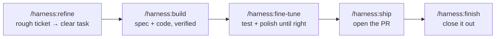
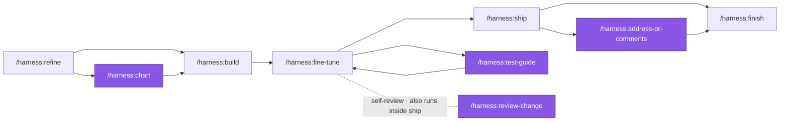
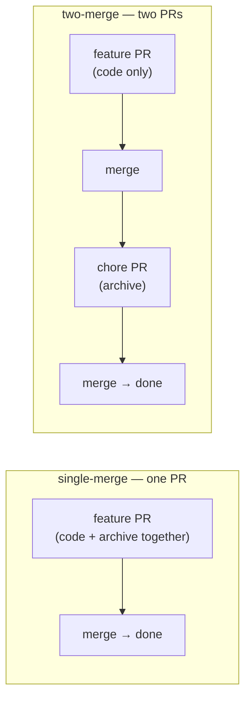

# Getting Started

New to the harness? Start here. This is the **one path** (the _golden path_) most work follows, in order.
For every fork, gate, and sub-skill, see the full map in [pipeline.md](pipeline.md).

One rule to remember: **you set it up once, then you run the same loop for every ticket.**

---

## 1. Set up — once per project

The harness runs on [OpenSpec](https://github.com/Fission-AI/OpenSpec) — a hard dependency. Install it
and initialize it in your project **before** `harness:init`:

```text
npm install -g @fission-ai/openspec@latest   # once, globally
openspec init --tools claude                  # once, in the project

/harness:init  →  writes docs/HARNESS.md
```

`harness:init` looks at your project, asks you a few things it can't guess, and writes
**`docs/HARNESS.md`** — the one file that tells every other skill how _your_ project builds, tests,
and ships. Until this exists, nothing else works.

Do this once. You only re-run it when your project's setup changes.

---

## 2. Ship a change — the loop you repeat



Five steps, same order, every time. That's the whole thing.

| Step          | Command              | What you get                                                                                                   | Reach for it when                                   |
| ------------- | -------------------- | -------------------------------------------------------------------------------------------------------------- | --------------------------------------------------- |
| **Refine**    | `/harness:refine`    | A rough ticket turned into a clear, spec-ready task.                                                           | You have a ticket or an idea, but it's fuzzy.       |
| **Build**     | `/harness:build`     | The spec written _and_ the code implemented — verified, but **not shipped**.                                   | The task is clear and you're ready to make it real. |
| **Fine-tune** | `/harness:fine-tune` | Where you land after build: test it, fix what's off, commit — batched so edits stay on-ticket and don't drift. | Right after build, until it's right.                |
| **Ship**      | `/harness:ship`      | A pushed branch and an open PR.                                                                                | You've tested + polished and it's good.             |
| **Finish**    | `/harness:finish`    | Specs synced, change archived, and the tracker updated if your project wired that hook.                        | The PR is merged.                                   |

That's the spine. If you only remember these five, you can run the harness.

> **How you test inside fine-tune:** `/harness:test-guide` walks you through the scenarios one at a
> time (or just drive the change by hand). It's the _test step_ of the fine-tune loop — and you can
> run it on its own any time you only want to test, not fix.

---

## 3. Helpers — step off the path when you need them

The **dark line** is the path you always walk. After `build` you land in **`fine-tune`** — that's
where you polish and, through `test-guide`, test. Each **purple** helper is an optional side-trip:
branch off, use it, rejoin.



Two more aren't tied to a phase — reach for them any time:
**`/harness:status`** ("where is this change, what's next?") and
**`/harness:retro`** (make the harness itself better, from past runs).

| Helper                         | Reach for it when                                                                                                        |
| ------------------------------ | ------------------------------------------------------------------------------------------------------------------------ |
| `/harness:chart`               | You're not sure _how_ to build it — compare approaches, weigh tradeoffs, pick a route to hand to build. _(before build)_ |
| `/harness:test-guide`          | You want to walk through testing, one scenario at a time. _(fine-tune runs this; call it alone to just test)_            |
| `/harness:review-change`       | You want a skeptical self-review. _(ship runs this; call it alone for out-of-pipeline changes)_                          |
| `/harness:address-pr-comments` | Your PR came back with review comments to work through. _(after ship)_                                                   |
| `/harness:status`              | You lost the thread — "where is this change, and what's next?" _(any time)_                                              |
| `/harness:retro`               | You want the harness itself to get better, from data on past runs. _(occasional)_                                        |

---

## Two ways `build` can spec a change

`build` can write a full spec or skip the spec — decided per change. `harness:refine` recommends which,
and `build` sets it. You rarely choose by hand.

One question decides it: **does this change what a feature _does_ or _promises_?**

| Mode                 | What `build` writes                                                                                                                       | Pick it when                                                                                                                                   |
| -------------------- | ----------------------------------------------------------------------------------------------------------------------------------------- | ---------------------------------------------------------------------------------------------------------------------------------------------- |
| **full** _(default)_ | The complete OpenSpec spec — a proposal, a design, **spec deltas** (the behavior, written as Given/When/Then), heavy reviews, then tasks. | The change adds or alters what a capability _does_ — new behavior, a changed contract, a new rule.                                             |
| **spec-less**        | Everything except the spec deltas — proposal, a lean design, a review, tasks. Still verified and shipped the same way.                    | The behavior stays the same — refactors, cleanups, internal fixes. _(Even across many files: a pure refactor is spec-less no matter how big.)_ |

Default is **full**; spec-less is the earned exception. And it's safe — if `build` discovers the change
_does_ touch real behavior partway through, it upgrades itself to full automatically.

> **On the spec deltas:** in full mode, `build` writes them as OpenSpec spec files — the Given/When/Then
> scenarios that become your project's _living spec_. That's the heart of how OpenSpec works; see the
> [OpenSpec docs](https://github.com/Fission-AI/OpenSpec) for the spec-driven method the harness is built on.

---

## One setup choice: how `finish` lands

When you set up the project, `harness:init` asks how the final bookkeeping (syncing specs + archiving
the change) should merge. Two options — pick once, it lives in `docs/HARNESS.md`.



| Mode             | What happens                                                                                                     | Pick it when                                                                                                                                          |
| ---------------- | ---------------------------------------------------------------------------------------------------------------- | ----------------------------------------------------------------------------------------------------------------------------------------------------- |
| **single-merge** | The spec-sync + archive ride _inside_ the feature PR. One review, one merge.                                     | You want the least ceremony — solo work, small teams, fast iteration. Fewer moving parts.                                                             |
| **two-merge**    | The feature PR merges first (code only). Then `finish` opens a _second_ "chore" PR with the spec-sync + archive. | You want the feature PR's diff to stay **clean code, no bookkeeping churn** — strict review, protected branches, larger teams, separate audit trails. |

Same skills either way — only the last step differs. Not sure? Start with **single-merge**; it's
simpler, and you can switch later.

---

## Your first run, start to finish

```text
/harness:init            # once — sets up this project
/harness:refine          # turn your ticket into a clear task
/harness:build           # spec it and build it
/harness:fine-tune       # test (via test-guide) + polish until it's right
/harness:ship            # open the PR
/harness:finish          # sync + archive onto the still-open PR
# → merge the PR — closes the change
```

> That last order is **single-merge** (the recommended default): `finish` runs _before_ the merge, so
> the spec-sync + archive ride the open PR. In **two-merge** it flips — merge the feature PR first, then
> run `/harness:finish` to open the chore PR. See [_One setup choice_](#one-setup-choice-how-finish-lands) above.

Everything else is a detour off this line, taken only when you need it.

---

_Want the complete picture — every branch, gate, and internal step? → [pipeline.md](pipeline.md)._
