# Harness Pipeline — End-to-End Chain

The full skill chain, ticket → merged change. Edit this diagram freely; it's the canonical view of
the pipeline. Legend:

- **blue** = a `harness:*` command the operator invokes
- **purple** = an internal step / sub-skill / agent
- **green** = a vendor OpenSpec skill (assumed present, not shipped here)
- **grey** = the binding layer (config the skills read)
- **gold (diamond)** = an automatic decision branch
- **gold (rounded)** = a human gate

```mermaid
flowchart TB
  classDef cmd fill:#1f6feb,stroke:#0b3a8a,color:#fff,font-weight:bold
  classDef sub fill:#8957e5,stroke:#4b277a,color:#fff
  classDef vendor fill:#1a7f37,stroke:#0a4a1f,color:#fff
  classDef cfg fill:#6e7681,stroke:#3a3f44,color:#fff
  classDef human fill:#bf8700,stroke:#7a5600,color:#fff,font-weight:bold
  classDef dec fill:#d29922,stroke:#7a5600,color:#000,font-weight:bold

  INIT["/harness:init<br/>scan project · interview · write docs/HARNESS.md"]:::cmd --> HN["docs/HARNESS.md (binding layer)<br/>sensors · paths · conventions · gates · task-tracker verbs+stage-hooks · runtime-verification"]:::cfg
  HN -. "read by every skill" .-> R

  R["/harness:refine<br/>ticket → well-formed task"]:::cmd --> H1(["👤 task ready"]):::human
  H1 --> CH["/harness:chart<br/>(optional · chart the how · options → weigh → pick)"]:::cmd --> B
  H1 --> B["/harness:build [gated*|yolo]<br/>keeps a progress file → resumable"]:::cmd

  B --> DET{"authored spec exists?<br/>openspec list --json"}:::dec
  DET -- "no → author" --> SM{"spec_mode?<br/>refine recommends · build writes harness/spec-mode"}:::dec
  SM -- "full (default)" --> NP["proposal.md"]:::vendor
  NP --> NR["recon"]:::sub --> ND["design.md + specs"]:::vendor --> NRA["architecture review"]:::sub --> NRD["design review"]:::sub --> NT["tasks.md"]:::vendor --> MODE
  SM -- "spec-less (small, no spec-worthy change)" --> SP["proposal.md"]:::vendor --> SR["recon"]:::sub --> SD["design.md (lean)"]:::vendor --> SLR["spec-less review<br/>(one lens · vs proposal.md + design.md)"]:::sub --> ST["tasks.md"]:::vendor --> MODE
  SLR -. "spec-worthy found → escalate: author specs, flip full" .-> ND
  DET -- "yes → resume (>1 open → ask which)" --> MODE{"mode?"}:::dec

  MODE -- "gated (default): review spec · edit→loop · proceed→go" --> HG(["👤 operator reviews spec"]):::human --> CORE
  MODE -- "yolo: straight through" --> CORE

  subgraph CORE["implement-and-verify core · stop-on-fork"]
    direction TB
    AE["implement · grouped local commits"]:::sub --> ASN["sensors (HARNESS.md)"]:::sub --> AB["behavioral-verify (binding)"]:::sub --> AV["openspec-verify (vendor)"]:::vendor --> ARV["harness:review-change (build-run)<br/>isolated judge · doer ≠ judge · this run's diff"]:::sub
  end

  CORE --> HT(["👤 verified locally — NOT shipped<br/>test it yourself"]):::human
  HT -. "needs polish" .-> FT["/harness:fine-tune<br/>fix → test → approve → commit loop"]:::cmd -.-> HT
  HT -. "want a self-review first" .-> LR["/harness:review-change (operator)<br/>4-stance self-review · fix clear · queue decisions"]:::cmd -.-> HT
  HT -- "ready to ship" --> SH["/harness:ship<br/>pre-ship review (thin) → push + open PR"]:::cmd

  SH --> MM{"finish merge mode?<br/>HARNESS.md"}:::dec
  SH -. "PR has comments" .-> APC["/harness:address-pr-comments<br/>triage · auto-fix · reply · resolve"]:::cmd -.-> MM
  MM -- "two-merge" --> H3(["👤 review + MERGE feature PR"]):::human --> F["/harness:finish<br/>sync-specs + archive → chore PR (2nd merge)"]:::cmd --> H4(["👤 merge chore PR — final gate"]):::human
  MM -- "single-merge" --> FS["/harness:finish<br/>sync-specs + archive · rides the still-open PR<br/>(archive-before-merge · no 2nd PR)"]:::cmd --> H3S(["👤 review + MERGE feature PR — closes the change"]):::human

  %% observability loop — the harness improves itself from data
  CORE -- "append run row" --> LOG[("run-log · JSONL<br/>git-ignored telemetry")]:::cfg
  F -. "backfill reality fields (merged, ci, comments)" .-> LOG
  FS -. "backfill reality fields" .-> LOG
  LOG --> RV["/harness:retro<br/>aggregate · surface friction · propose edits"]:::cmd
  RV -. "human-approved edits to skills / config" .-> HN
```

## Notes on the chain

- **`harness:build` is the workhorse** — one skill, two modes:
  - It first auto-detects whether an authored OpenSpec change already exists (`openspec list --json`).
    None → it authors one (proposal → recon → design → reviews → tasks). Exists → it resumes straight
    to implementation (your hand-authored / authored-earlier / interrupted case). More than one open
    change → it asks which.
  - `gated` (default) stops after tasks, shows you the spec, and loops "ready?" until you approve or
    request edits. `yolo` skips that gate. **Both still stop on a genuine fork** (decision fork,
    design-level problem, scope drift, uncaused sensor/verify failure).
  - It keeps **its own progress file** under the change's committed `harness/` dir
    (`openspec/changes/<change>/harness/`) so it always knows where it left off — resumable across sessions.
    (All per-change harness artifacts — reviews, recon, decisions, pr-body — live there, committed so the
    team sees them. Supersedes the legacy `.specd/` layout.)
- **Spec-less mode (small changes).** `refine`'s triage recommends `spec-less` for a change that alters no
  spec-worthy behavior ([triage-lenses](../rules/triage-lenses.md)); `build` records it in the
  `harness/spec-mode` marker and skips **only** the `specs/` delta + strict-verify — it still authors
  proposal + a lean design + tasks, runs a single lightweight **spec-less review** against `proposal.md` + `design.md`
  ([spec-less-review](../rules/spec-less-review.md)), and keeps sensors + behavioral-verify + ship. If impl
  uncovers a spec-worthy change, an **escalation tripwire** flips it to full (author specs, run the heavy
  reviews) with no lost work. The mode is an **explicit flag, never inferred** from a missing `specs/` —
  absent ⇒ full, so every existing change is unaffected.
- **Nothing ships automatically.** The core ends at *verified locally, not shipped*. You test it
  yourself; iterate with `harness:fine-tune` if needed. `harness:ship` (push + open PR) is a separate,
  deliberate step you trigger when ready.
- **`harness:fine-tune`** is the polish loop (fix → test → approve → commit), reused as-is except its
  test step binds to HARNESS.md sensors and it hands off to `harness:ship` when you're done. Commits
  are local; ship owns push + PR. **It is a sticky mode** (like OpenSpec Explore): it re-anchors
  every turn, survives nested skills (runs them, then resumes the loop), and exits ONLY on an explicit
  "exit" or an asked-and-confirmed yes — backed by a small "fine-tune active" marker so it never
  forgets it was fine-tuning.
- **`harness:review-change`** is the **one review engine, run at three altitudes** via a `mode` arg —
  a single isolated reviewer-fixer sub-agent (doer ≠ judge) runs four escalating stances (baseline →
  cross-cutting → adversarial-verify → docs-alignment), auto-fixing clear/no-trade-off findings and
  surfacing only decision-needing ones. **`build-run`** is build's Step F.4 (this run's diff, autonomous,
  returns `judge_findings` to the run-log). **`pre-ship`** is ship's pre-push gate (whole branch, *thin* —
  only the cross-commit seams + commits no build-run covered; a clean review never stops, decision-needing
  findings surface as ship's genuine-fork carve-out). **`operator`** is the optional side-loop at the
  verified-not-shipped gate (self-review out-of-pipeline changes; never commits — auto-fixes land
  uncommitted so `git status --short` separates them from operator WIP). The reviewed-range footer stamped
  by `build-run` is how `pre-ship` avoids re-reviewing what build-run already covered.
- **`harness:finish` merge-gate is confirmable, not a wall.** Default = two-merge (feature PR, then a
  chore PR for sync+archive). If it can't confirm the feature merged, it ASKS ("already merged /
  tested in prod / single-merge flow?") rather than hard-stopping. **Single-merge mode** is
  configurable per project (folds sync+archive into one landing, no second PR) — there `finish` runs
  **before** the merge, riding the still-open feature PR (archive-before-merge); the human merge that
  follows is the change's close, **not** a skipped step. So the ordering flips by mode: two-merge is
  `merge → finish`, single-merge is `finish → merge`.
- **`harness:chart`** plots the *how* — given a settled *what* (from `refine` or a clear goal), it
  surveys the approaches, weighs the genuinely-live routes one at a time, and converges on a chosen
  route to hand to `build` — the *how*, not the *what*; decomposes into decision areas when a change
  genuinely has several. Its output is a recommendation build may deviate from (logged), not a mandate.
  Optional; runs between `refine` and `build`. Broad, open-ended ideation lives in `/opsx:explore`.
- **Behavioral-verify** is a HARNESS.md binding (bring up → exercise → observe → verdict) — the Swift
  `run` skill generalized. See [runtime-verification-binding.md](runtime-verification-binding.md).
- **Task-tracker touchpoints** run through the verb contract **+ configurable per-stage hooks**: at
  each stage (refined / building / verified / PR-open / merged) the project's HARNESS.md can map a
  tracker action — move column, set status, add label. All optional, all project-configured.
- **Gate H3 / H3S** = review + merge the PR (the real review) — **H3 before `finish`** in two-merge,
  **H3S after `finish`** in single-merge. **`address-pr-comments`** is a side-loop on the open PR, not a
  linear stage.
- **Observability loop (self-improvement).** `build` appends one JSONL row per run to the run-log
  (sensors, failures, iterations, interventions, outcome — keystone `skill_version`). `finish`/`retro`
  backfill reality fields (merged, ci_passed, comments). `harness:retro` aggregates it and **proposes**
  (human-approved, never auto-applied) edits back to the skills/config. Schema:
  [harness-runs.SCHEMA.md](../templates/harness-runs.SCHEMA.md). JSONL because a script aggregates it.
- **Vendor (green)** nodes assume the consuming project has OpenSpec installed.
